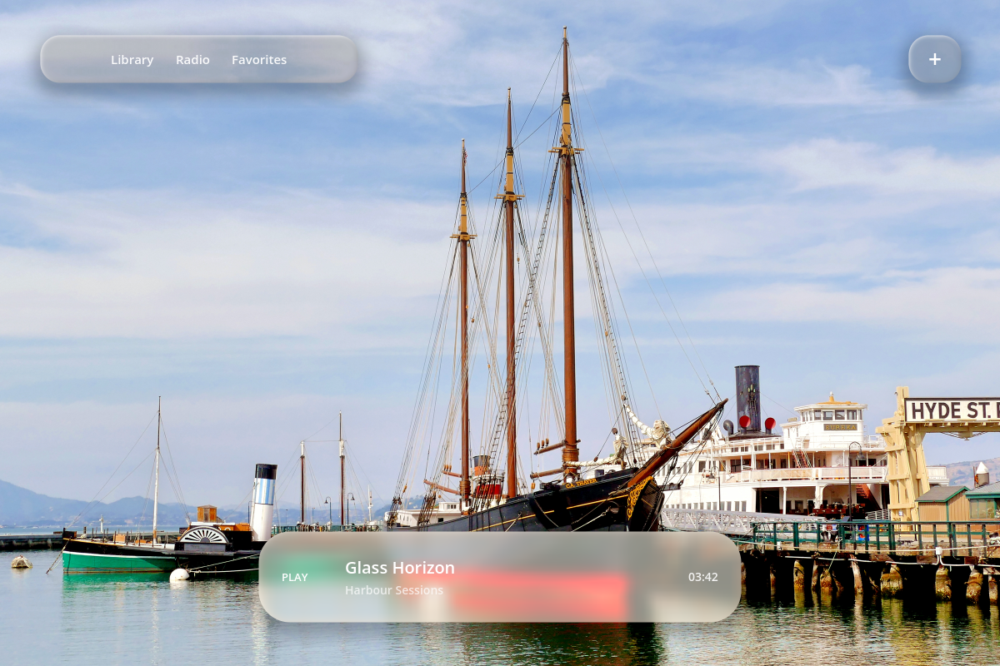
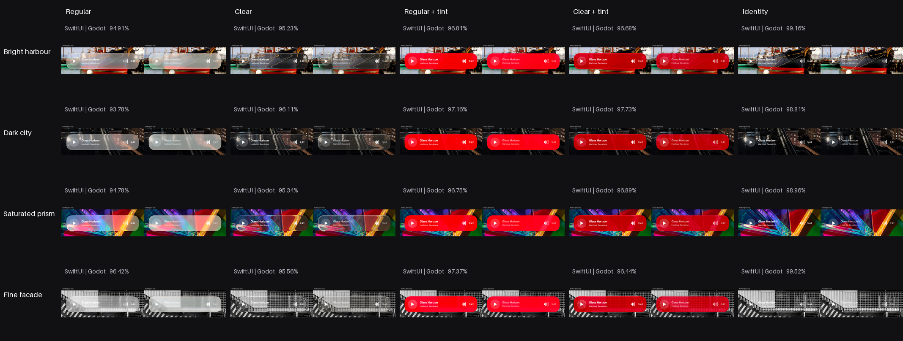

# Liquid Glass for Godot

**Apple's Liquid Glass material, rebuilt as a reusable Godot `Control`** — a
live refractive surface you drop over your own scene and put normal Godot
controls inside.

[](https://github.com/1234igor/godot-liquid-glass/actions/workflows/check.yml)
[](https://godotengine.org)
[](LICENSE)
[](project.godot)



Not a blur, and not a screenshot with a gradient on top. The surface reads the
live framebuffer every frame through a `canvas_item` screen shader: a
rounded-rectangle signed distance field for the bezel, edge-localized
refraction, mip diffusion, adaptive warmth, tint transforms, and interaction
illumination. Content underneath can move as fast as it likes.

## How close is it?

Close enough that the interesting part is the measurement. Every material is
captured side by side against a real SwiftUI `.glassEffect` built with Xcode,
over four deliberately hostile backgrounds, and compared pixel by pixel.



Measured on macOS 27 with Godot 4.7.1, 20 pairs at 2400 × 1600:

| Metric | Range across the matrix |
|--------|------------------------|
| Glass-region similarity, the four materials | 93.78 – 97.73 % |
| Glass-region similarity, Identity | 98.81 – 99.52 % |
| Whole-window similarity | 99.42 – 99.94 % |

**Known gap.** The optics were calibrated against macOS 26. On macOS 27 Apple
moved the Regular material slightly, and Regular now measures 93.78 – 96.42 %
against a 95 % acceptance gate that the other materials still clear — so
`validation/tools/full-visual.sh` reports a failure on Regular out of the box.
The gate has been left where it is rather than lowered to make the run green.
Clear, both tinted materials and Identity are unaffected.

The reference app, the capture scripts and the comparison tool are all in
[`validation/`](validation/README.md), so every number here is reproducible
rather than claimed.

## Try it

```sh
git clone https://github.com/1234igor/godot-liquid-glass
godot --path godot-liquid-glass
```

The default scene is [`examples/media_player/`](examples/media_player/):
independent Clear and Regular surfaces over live content, with hover and press
handled by the component. Press <kbd>M</kbd> to cycle every surface through
Regular, Clear, Regular Tinted, Clear Tinted and Identity.

## Use it

Copy [`addons/liquid_glass/`](addons/liquid_glass/) into a Godot 4.7 project.
Then build a panel from script, or attach `liquid_glass_panel.gd` to a
`Control`:

```gdscript
var glass := LiquidGlassPanel.new()
glass.position = Vector2(320.0, 640.0)
glass.size = Vector2(560.0, 104.0)
glass.corner_radius = 38.0
glass.material_style = LiquidGlassPanel.MaterialStyle.CLEAR
add_child(glass)

var title := Label.new()
title.text = "Now Playing"
glass.content_layer.add_child(title)
```

`LiquidGlassPanel` owns the screen capture, the screen-reading shader, a
separate elevation shadow, and a foreground `content_layer`. Panels in the same
contiguous glass overlay share one framebuffer capture per frame, so capture
cost does not grow with the number of surfaces. Your code sets geometry and
material style, then adds ordinary Godot controls to `content_layer`.

| Property | What it does |
|----------|--------------|
| `material_style` | Regular, Clear, Regular Tinted, Clear Tinted, or Identity |
| `corner_radius` | Radius in viewport points |
| `warmth` | Regular-material adaptation to the media underneath |
| `set_interaction_energy()` | Direct animation control, 0 to 1 |

Identity disables optics, shadow, draw and capture while leaving foreground
content in place — useful as an A/B switch and as a cheap fallback. Each
component owns its own `ShaderMaterial`, so changing one surface never alters
another.

## Rendering order

Draw your media or world content first, then a contiguous group of glass
components. The addon captures the framebuffer at the first glass, draws each
shadow and refractive surface, then draws each `content_layer` above its own
surface — so text and icons stay crisp instead of being refracted along with
the background.

Shared capture assumes the group keeps a stable draw order and that ordinary
`CanvasItem`s are not interleaved between its panels. Position and content may
animate freely, but do not change panel z/tree order at runtime, and do not put
the group under a y-sorted parent. Give each independently ordered glass
stratum its own `CanvasLayer`; each layer then owns its own live capture.

## Performance

The shared snapshot is refreshed every frame, including when the media, the
game content or the glass surfaces themselves move fast.
[`PERFORMANCE.md`](PERFORMANCE.md) has the dynamic-scene measurements and the
offscreen, self-cleaning benchmark command.

## Layout

| Path | What lives there |
|------|------------------|
| [`addons/liquid_glass/`](addons/liquid_glass/) | The reusable component and its shaders — the part you copy |
| [`examples/media_player/`](examples/media_player/) | Integration example and default scene |
| [`validation/`](validation/) | SwiftUI reference app, capture scripts, comparison tool, evidence |
| [`assets/`](assets/BACKGROUNDS.md) | The four stress backgrounds and where they came from |

## Requirements

- Godot 4.7, GL Compatibility renderer
- macOS only for `validation/` — the SwiftUI reference needs macOS 26 or newer
  and a matching Xcode. The addon itself has no macOS-specific code.

## Licence

[MIT](LICENSE). Use it in commercial work, including paid App Store apps,
without asking. See [THIRD-PARTY.md](THIRD-PARTY.md) for the bundled assets.

"Liquid Glass" is Apple's name for its own design language. This project is an
independent reimplementation for Godot, is not affiliated with or endorsed by
Apple, and ships none of Apple's code or assets.
