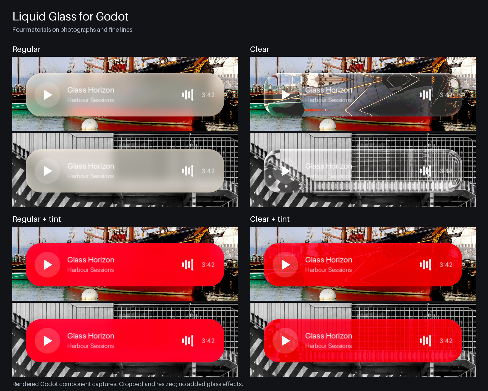

# Liquid Glass for Godot

Glass panels for Godot with refraction, blur, rounded corners, and hover and press effects. Choose Clear or Regular glass, with optional tinting.



[Image credits and licenses](IMAGE-LICENSES.md): Bernard Spragg (CC0) and project-generated backgrounds (MIT).

## Run

Requires Godot 4.7 with the GL Compatibility renderer. From this checkout:

```sh
godot --path .
```

Press **M** to cycle Regular, Clear, both tinted styles, and Identity. Hover or press a panel to change its illumination.

## Use the control

Copy [`addons/liquid_glass/`](addons/liquid_glass/) into your project:

```gdscript
var glass := LiquidGlassPanel.new()
glass.position = Vector2(320, 640)
glass.size = Vector2(560, 104)
glass.corner_radius = 38
glass.material_style = LiquidGlassPanel.MaterialStyle.CLEAR
add_child(glass)

var title := Label.new()
title.text = "Now Playing"
title.position = Vector2(24, 24)
glass.content_layer.add_child(title)
```

Draw the background before the panels. Put labels and controls in `content_layer` so they stay sharp. Identity disables the material and shadow while keeping that content visible.

Panels in the same canvas share a background capture. Keep them together in a stable draw order, without other drawing nodes between them. Use separate `CanvasLayer`s for independently ordered groups.

## Development

[Rendering checks and screenshot scripts](validation/README.md) · [Benchmarks](PERFORMANCE.md).

[MIT license](LICENSE). See [third-party notices](THIRD-PARTY.md).
